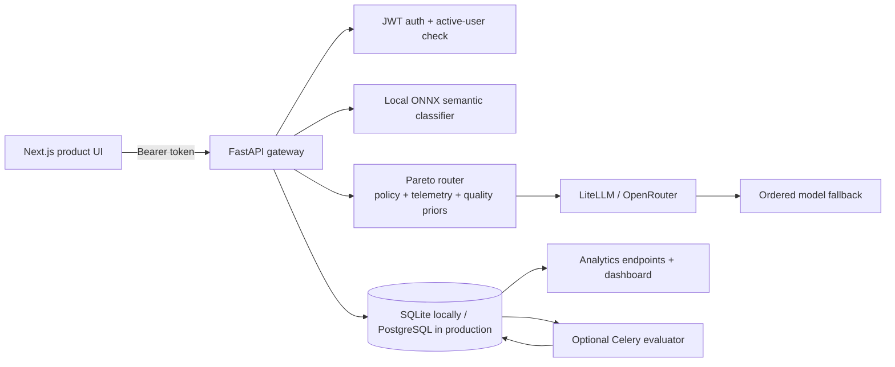

# RouteAlpha

**An observable LLM routing control plane for balancing cost, latency, and quality.**

RouteAlpha sits between an application and its language-model providers. It classifies a request, applies a routing policy, selects a model tier, retries a bounded fallback path when needed, and records the decision and execution outcome for operators to inspect.

The repository includes a complete product surface: a Next.js application for authentication, live inference, routing observability, and contact capture; plus a FastAPI backend that performs routing, provider execution, logging, and analytics.

> RouteAlpha is an engineering project and active platform prototype. The current model catalog and telemetry implementation are suitable for local development and demonstration; the production hardening roadmap is documented below.

## Why RouteAlpha

Most AI applications begin by sending every request to the same model. That is simple, but it makes cost unpredictable and does not distinguish a short classification task from a reasoning-heavy request. RouteAlpha centralizes that decision.

| Instead of | RouteAlpha provides |
| --- | --- |
| One hard-coded model for every task | A stable `cheap` / `medium` / `strong` tier abstraction. |
| Unexplained provider calls | Route reasoning, semantic match data, candidate scores, and selected/resolved routes. |
| A provider failure becoming a user failure | Ordered fallback across distinct candidate models. |
| Cost and latency hidden in application logs | Persisted request metadata and a live analytics workspace. |
| Static quality assumptions | Optional structured validation and asynchronous evaluator feedback. |

## Product tour

| Surface | Purpose |
| --- | --- |
| `/` | Product overview, live metrics preview, platform explanation, pricing, and FAQ. |
| `/auth` | Account registration and sign-in with optional TOTP code support. |
| `/infer` | Authenticated inference playground for testing prompts, priorities, routes, cost, latency, and generated output. |
| `/dashboard` | Authenticated observability workspace for route, model, cost, latency, fallback, and recent-request analytics. |
| `/contact` | Backend-connected demo and use-case intake. |

## Architecture



### Inference lifecycle

1. The client sends a prompt, task type, priority, and optional routing policy to `POST /infer`.
2. The API authenticates the request and optionally classifies the prompt locally with ONNX.
3. The router scores each tier using normalized cost, normalized latency, and a task-specific accuracy rating.
4. RouteAlpha calls the selected provider/model through LiteLLM and retries the configured fallback chain only when necessary.
5. It persists the selected route, resolved route, attempts, cost estimate, latency, token estimates, and response.
6. The client receives the generated output plus a decision record it can inspect.

For the routing formula and feedback loop, see [Dynamic routing](docs/dynamic_routing.md). For a detailed architecture discussion, see the [system design guide](docs/routealpha_system_design_hld.md).

## Routing policy

The dynamic router selects the candidate with the lowest score:

```text
score = cost_weight × normalized_cost
      + latency_weight × normalized_latency
      - accuracy_weight × accuracy_rating
```

Callers can provide weights that total `1.0`, or use priority presets:

| Priority | Cost | Latency | Accuracy |
| --- | ---: | ---: | ---: |
| `cheap` | 0.80 | 0.15 | 0.05 |
| `fast` | 0.15 | 0.80 | 0.05 |
| `quality` | 0.05 | 0.10 | 0.85 |
| `balanced` | 0.34 | 0.33 | 0.33 |

If local semantic assets or dynamic scoring fail, the API uses deterministic static routing. If a provider request fails, it tries the configured fallback sequence and returns both the original selection and the route that actually resolved the request.

## Technology

| Layer | Technology |
| --- | --- |
| Web application | Next.js 16, React 19, TypeScript, Tailwind CSS, Recharts |
| API | Python, FastAPI, Pydantic, SQLAlchemy |
| Provider gateway | LiteLLM and OpenRouter |
| Semantic routing | ONNX Runtime, tokenizers, local MiniLM assets |
| Data | SQLite for a quick local run; PostgreSQL for production |
| Background evaluation | Celery, Redis-compatible broker, JSON Schema, optional LLM judge |
| Security | PBKDF2 password hashing, signed JWTs, bearer auth, failed-login limiting, opt-in TOTP, server-side admin dependency |

## Quick start

The complete local setup guide is available at [docs/run_routealpha_locally.md](docs/run_routealpha_locally.md).

```bash
# Terminal 1 — API
cd backend
./.venv/bin/python -m uvicorn app.main:app --reload --host 127.0.0.1 --port 8000

# Terminal 2 — web application
cd frontend
npm install
npm run dev
```

Open `http://localhost:3000`, create an account, then try the playground and dashboard.

### Environment configuration

Create `backend/.env` with at least:

```env
DATABASE_URL=sqlite:///./routealpha.sqlite3
OPENROUTER_API_KEY=your_openrouter_key
AUTH_SECRET_KEY=replace-with-a-long-random-secret
```

Create `frontend/.env.local`:

```env
NEXT_PUBLIC_API_BASE_URL=http://127.0.0.1:8000
NEXT_PUBLIC_SITE_URL=http://localhost:3000
```

Never commit real environment files or credentials. The API starts without ONNX model assets, but uses static routing until they are present.

## API snapshot

| Endpoint | Auth | Description |
| --- | --- | --- |
| `GET /health` | No | API health check. |
| `POST /auth/register` | No | Create an account and receive a bearer token. |
| `POST /auth/login` | No | Sign in; supports an `otp_code` for enrolled accounts. |
| `GET /auth/me` | Yes | Restore/validate the current session. |
| `POST /auth/2fa/setup` | Yes | Generate an authenticator-app provisioning secret. |
| `POST /auth/2fa/enable` | Yes | Verify a current TOTP code and enable 2FA. |
| `POST /infer` | Yes | Run routed inference. |
| `GET /analytics/*` | Yes | Read routing, model, cost, latency, and recent-request analytics. |
| `POST /contact` | No | Persist a demo request and queue notification delivery. |

See the full request and response contract in [docs/inference_api_reference.md](docs/inference_api_reference.md).

## Security posture

RouteAlpha currently includes:

- server-validated password rules (8–128 characters, at least one letter and number);
- PBKDF2-HMAC-SHA256 password hashing with a random salt;
- signed, expiring bearer tokens and active-user checks on protected routes;
- failed-login limiting by IP and normalized email address;
- optional time-based one-time password (TOTP) enrollment;
- a reusable `require_admin` server-side dependency for future privileged endpoints; and
- background contact notifications so SMTP delivery cannot block form submission.

The local limiter uses in-memory storage. A horizontally scaled production deployment should use a shared Redis-backed limiter, tenant-scoped authorization, managed secret rotation, TLS, audit logs, and rate/budget controls for model traffic.

## Development quality checks

```bash
cd frontend
npm run lint
npm run build
```

The project also includes Playwright as a development dependency for browser-level checks. See [docs/debug-log.md](docs/debug-log.md) for recorded smoke and UI checks.

## Repository map

```text
route-alpha/
├── frontend/                  # Next.js product experience
│   ├── app/                   # Landing, auth, dashboard, infer, contact routes
│   └── components/            # Shared navigation, session state, dashboard UI
├── backend/
│   ├── app/main.py            # API boundary and request orchestration
│   ├── app/services/          # Semantic and Pareto routers
│   ├── app/llm_service.py     # Provider execution and fallback behavior
│   └── app/tasks/evaluator.py # Optional asynchronous feedback loop
├── docs/                      # API, local-run, architecture, and debug references
└── PROJECT_STATUS.md          # Current implementation state and next steps
```

## Roadmap

- Move process-local telemetry and rate-limit state to Redis before horizontal scaling.
- Benchmark and differentiate the `medium` and `strong` model mappings.
- Add tenant/organization boundaries, roles, quotas, and budget enforcement.
- Add idempotency keys, provider circuit breakers, request deadlines, and streaming responses.
- Move analytics aggregation and evaluator work to a durable event/outbox pipeline.
- Expand deterministic and end-to-end test coverage around routing and UI workflows.

## Documentation

- [Run RouteAlpha locally](docs/run_routealpha_locally.md)
- [Inference API reference](docs/inference_api_reference.md)
- [Dynamic routing](docs/dynamic_routing.md)
- [System design / HLD guide](docs/routealpha_system_design_hld.md)
- [Project status](PROJECT_STATUS.md)

---

Built to make LLM routing an explicit, measurable product decision.
